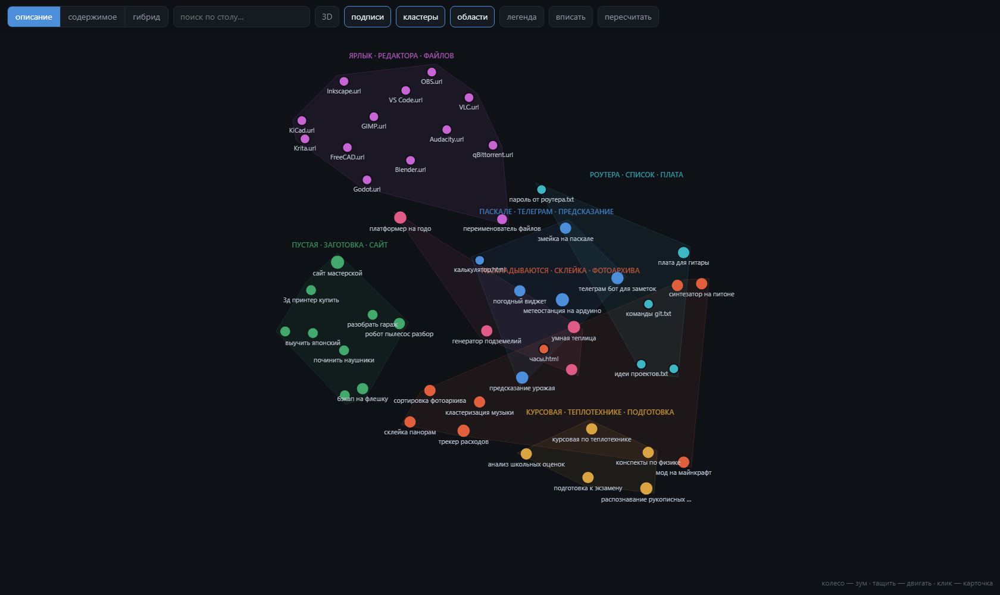
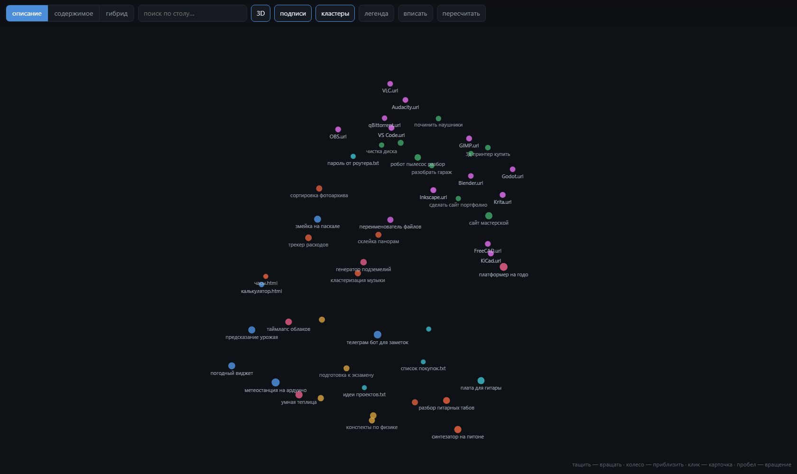

# Desktop Atlas — смысловая карта рабочего стола

Раскладывает папки и файлы рабочего стола в 2D по смыслу, а потом расставляет
**реальные значки Windows** согласно этой карте: соседи на экране = соседи по теме.

Эмбеддинги LaBSE, кластеризация и UMAP — всё считается локально, без единого
обращения в сеть.



Пан и зум как в картах, поиск, кластеры с автоматическими названиями;
клик по точке открывает настоящую папку в проводнике. На реальном столе
ярлыки программ собираются в отдельную колонку, проекты одной темы становятся
соседями, а пустые папки-заготовки уезжают в свой угол — потому что «пустая
заготовка» это тоже смысл.

Есть 3D-режим: в трёх измерениях UMAP есть куда развести то, что на плоскости
слипается. Ближние точки крупнее и ярче, облако медленно поворачивается —
на плоском экране объём читается только через движение.



> Оба скриншота сняты с **демонстрационного** стола из `demo/` — набора
> выдуманных проектов. Настоящую карту показывать нельзя: имена папок это
> ровно то, чем человек занимается.

## Попробовать, не трогая свой стол

```
python demo/make_demo_desktop.py    # соберёт demo/desktop из выдуманных проектов
python scan_desktop.py demo/desktop # просканирует его вместо настоящего
cp demo/descriptions.json data/     # готовые описания к нему
python build_map.py
python serve.py
```

Полсотни выдуманных папок: электроника, веб, игры, обработка фотографий,
учёба, немного утилит, ярлыки программ и пустые заготовки — достаточно
разнотемно, чтобы кластеры были видны.

## Как запустить

Проще всего — двойной клик по `СТАРТ.bat`: он найдёт Python, при необходимости
посчитает карту с нуля и откроет вьювер.

Вручную:

```
python scan_desktop.py     # 1. собрать паспорта всех элементов -> data/items.json
python build_map.py        # 2. эмбеддинги + кластеры + 2D/3D   -> data/map.json
python serve.py            # 3. вьювер на http://127.0.0.1:8777
```

Нужен Python с `sentence-transformers`, `umap-learn`, `scikit-learn`.
Готовое окружение уже есть у соц аналитика:

```
"..\соц аналитик\socanalytic\venv\Scripts\python.exe" build_map.py
```

Первый прогон `build_map.py` считает LaBSE на процессоре ~10 минут.
Дальше работает кэш (`data/cache_*.npz`) — пересчитываются только изменившиеся элементы.

## Три варианта карты

| вариант | из чего эмбеддинг |
|---|---|
| **описание** | человекочитаемое описание элемента (`data/descriptions.json`) |
| **содержимое** | сырой контент: дерево файлов, расширения, куски кода и текста |
| **гибрид** | сумма нормированных векторов первых двух |

Во вьювере они переключаются кнопками сверху — видно, как одни и те же
папки перегруппировываются в зависимости от того, что мы считаем «смыслом».

Вид можно задать прямо ссылкой: `?3d`, `?v=содержимое`, `?nospin`.

### Что показало сравнение

Эмбеддинг сырого содержимого сначала провалился: **72 из 180 папок слиплись
в один кластер**. У всех проектов огромная общая часть — «это питоновский проект
с requirements.txt и `import`» — и она съедала почти весь косинус (средний
попарный косинус 0.417, то есть всё похоже на всё).

Лечится вычитанием общей компоненты (`decommon` в `build_map.py`): вычесть
средний вектор, перенормировать. После этого крупнейший кластер — 23 элемента,
и группы становятся осмысленными.

По качеству всё равно выигрывают описания: получается 24 чистых кластера
против 14 у содержимого. Именно вариант «описание» и разложен на реальный стол.

### Описания новых папок

Описание — это ровно тот текст, из которого считается позиция. Для новой папки
достаточно выделить её во вьювере, нажать «добавить описание», написать пару фраз
и нажать «пересчитать» — точка сама уедет к своим по смыслу. Без описания элемент
размещается только по имени.

## Расстановка реальных значков

```
python desktop_icons.py info                    # что там сейчас
python desktop_icons.py backup                  # позиции -> backups/
python layout_desktop.py описание --grid        # карта -> координаты
python desktop_icons.py apply data/layout.json  # применить (сам делает бекап)
python desktop_icons.py restore backups/<файл>.json   # откат
```

### Про размер значков

```
python desktop_icons.py iconsize   # что происходит с размером на самом деле
```

Команда только показывает — и это результат проверки, а не лень.
В реестре есть `Shell\Bags\1\Desktop\IconSize`, записать туда можно что угодно,
но **для рабочего стола проводник это значение не читает**: после записи 32
и перезапуска проводника значки как рисовались в 48 логических пикселей, так
и продолжили (замерено по скриншоту: глиф папки 64 физических px — это ячейка
72, то есть 48 логических при масштабе 150%). Ctrl+колесо, посланное окну
сообщением, проводник тоже игнорирует — ему нужен настоящий ввод.

Поэтому размер значков меняется руками: **Ctrl+колесо на рабочем столе**.
Это запоминается и переживает перезагрузку.

А вот на экране с высоким DPI значки кажутся огромными не из-за размера,
а из-за масштаба системы: при 150% обычные 48 логических пикселей превращаются
в 72 физических. `iconsize` печатает оба числа, чтобы было видно, где причина.

## Автозапуск

```
python desktop_icons.py autostart install
```

После перезагрузки раскладка разъезжается, и настройками это не лечится.
Размер значка Windows из реестра честно восстанавливает, а вот шаг сетки — нет:
при входе в систему она пересчитывает его по умолчанию для текущего масштаба
экрана, игнорируя сохранённые `IconSpacing` и `IconVerticalSpacing`. Значки
садятся на стандартную сетку, и смысловая раскладка рассыпается.

Поэтому состояние не настраивается один раз, а **переутверждается при каждом
входе**. `startup.py` ждёт, пока проводник построит рабочий стол, затем
возвращает шаг сетки, накладывает `data/layout.json` и поднимает сервер вьювера.

Ставится в папку «Автозагрузка», а не в планировщик заданий: задачи с триггером
«при входе в систему» планировщик создаёт только с правами администратора.
Запускается через `.vbs` под `pythonw.exe`, чтобы при входе не мелькала консоль.

```
python desktop_icons.py autostart status   # стоит ли, и хвост журнала
python desktop_icons.py autostart remove   # снять
python startup.py                          # проверить прямо сейчас
```

Что именно восстанавливать — в `data/state.json` (шаг сетки, файл раскладки,
поднимать ли сервер и сторожа). Журнал — `logs/startup.log`.

## Сторож раскладки

```
python watch.py          # следить
python watch.py --once   # проверить один раз
```

Одного восстановления при входе мало. Когда на рабочем столе появляется новый
файл или папка, проводник вставляет её в свой порядок заполнения и **сдвигает
всё, что идёт следом**: часть значков уезжает на ряд вниз, часть на два, нижние
перескакивают в соседнюю колонку. Замерено: из 185 значков 78 уехали на два
ряда, 75 на один, 14 сменили колонку. Автоупорядочивание при этом выключено —
отключить саму переупаковку нечем.

Поэтому раскладка не ставится один раз, а поддерживается. Сторож раз в четыре
секунды сверяет позиции с `data/layout.json` и возвращает всё на места.

Ручные перестановки он уважает: возврат срабатывает только если разъехалось
шесть значков и больше — столько за раз двигает проводник, а не человек.
Перетащил один значок куда хочешь — так и останется.

Новые папки сторож замечает и пишет о них в журнал, но в карту не добавляет:
у них ещё нет описания. Нажми «пересчитать» во вьювере — и они встанут
на своё место по смыслу.

### Как значки переставляются

Это перестановка, а не просто список присваиваний. При включённом
«выровнять по сетке» Windows не кладёт значок в клетку, которую прямо сейчас
занимает другой, — отпихивает в соседнюю. Значит важен порядок: сначала
освободить клетку, потом занимать.

Сначала это решалось волнами с перечиткой позиций у проводника после каждого
прохода — и работало плохо: отвечает он с задержкой, модель занятости
расходилась с правдой, и на плотном столе получалось 200 проходов,
202 парковки и 28 непоставленных значков.

Теперь по одному снимку позиций строится план целиком в памяти: идём по
цепочке «кто сидит на моём месте», рекурсивно освобождая её с хвоста;
замкнулось в кольцо — один участник уходит на времянку и разрывает круг.
Проводнику отдаётся готовая последовательность, каждый ход заведомо
в свободную клетку. Та же раскладка: **152 хода, ноль парковок, ноль промахов**.

Отдельная беда — сквоттеры. Появился новый файл, Windows посадила его в первую
свободную клетку, и та оказалась чужим местом. Двигать его никто не пытался
(в раскладке его нет), цель была заблокирована навсегда, и сторож бесконечно
докладывал «не на месте: 20». Теперь такие значки переселяются в клетки,
на которые никто не претендует, — с конца сетки, чтобы копились в дальнем
углу, а не лезли в глаза в левом верхнем.

`--grid` сажает значки в ячейки Windows, `--free` — в произвольные пиксельные
координаты, `--fill` — растянуть на всю ширину монитора вместо компактной области.

Откат всегда есть: `apply` перед работой сам сохраняет текущие позиции
и печатает готовую команду восстановления.

### Три вещи, о которые тут легко споткнуться

**Несколько мониторов.** ListView рабочего стола один на все экраны, и его
координаты отсчитываются от левого верхнего угла *виртуального* экрана.
Если слева стоит второй монитор, начало виртуального экрана отрицательное,
и координата x=0 — это чужой экран, а не край основного. Раскладка считает
рабочую область основного монитора через `EnumDisplayMonitors` и не выходит
за неё.

**Масштаб экрана.** Без объявления DPI-awareness Windows врёт про размеры окон,
а координаты значков приходят в настоящих пикселях — всё разъезжается.
`desktop_icons.py` объявляет `PER_MONITOR_AWARE_V2` при импорте.

**«Выровнять значки по сетке».** Выключить его сообщением извне система не даёт,
а со включённым она не поставит значок в ячейку, которую прямо сейчас занимает
другой — отпихнёт в соседнюю. Поэтому `set_positions` переставляет значки
волнами: на каждом проходе двигает только тех, чья ячейка уже свободна,
а зацикленные ожидания разрывает временной парковкой. Плюс координаты
раскладки заранее кладутся на настоящие узлы сетки Windows (они вычисляются
из текущих позиций, а не назначаются).

## Что где

```
scan_desktop.py      обход стола, сниппеты, разворот ярлыков
make_digest.py       выжимка items.json для чтения глазами
build_map.py         LaBSE -> кластеры -> UMAP, три варианта
layout_desktop.py    карта -> координаты значков (PCA-поворот + укладка)
desktop_icons.py     чтение/запись позиций значков через SysListView32
serve.py             локальный сервер вьювера + открытие папок по клику
startup.py           восстановление состояния при входе в систему
watch.py             сторож: возвращает раскладку, когда её ломает проводник
viewer/index.html    сама карта: пан, зум, поиск, кластеры, соседи, 3D
demo/                генератор выдуманного стола для скриншотов и проб
docs/                скриншоты (сняты с демо-стола)
data/                items.json, descriptions.json, map.json, layout.json,
                     state.json, кэши эмбеддингов
backups/             снимки позиций значков и старых настроек размера
logs/                журнал автозапуска
```

## Про приватность

Карта своего рабочего стола — это подробный слепок того, чем ты занимаешься.
Поэтому `data/` и `docs/` целиком в `.gitignore`: ни карта, ни описания,
ни скриншоты никуда не уезжают. Всё считается заново на своей машине.

`build_map.py` дополнительно маскирует в текстах токены, пароли, ключи и почты
перед тем, как что-либо попадёт в `map.json`. А вот `data/digest.md` — сырая
выжимка, и секреты в ней остаются; он нужен только для составления описаний,
после этого его можно удалить.

Сервер слушает только `127.0.0.1`, наружу отдаёт лишь вьювер и саму карту,
и умеет открывать исключительно то, что есть в карте и физически лежит
внутри папок рабочего стола.
